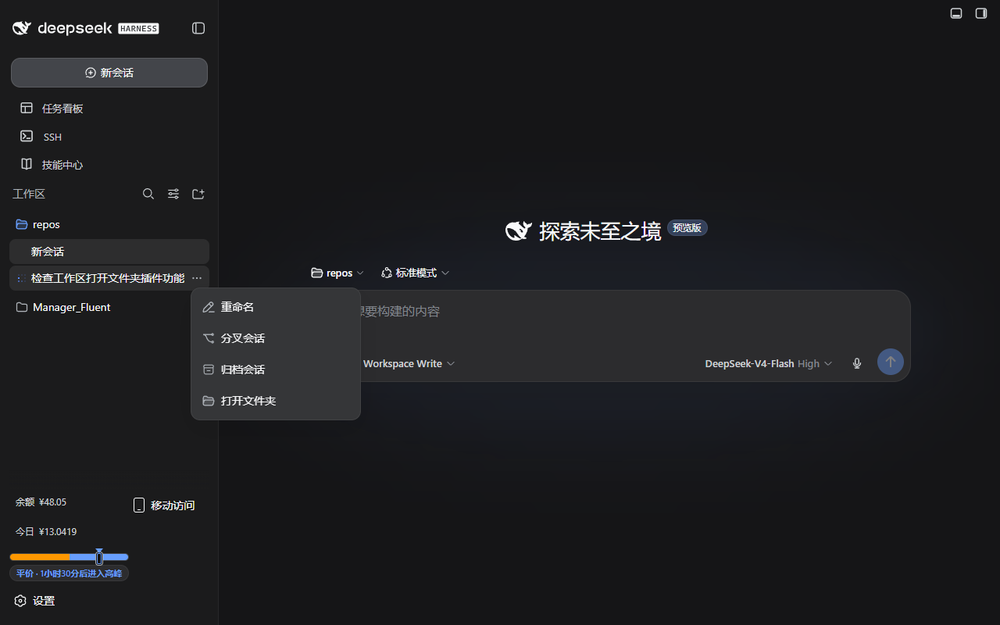
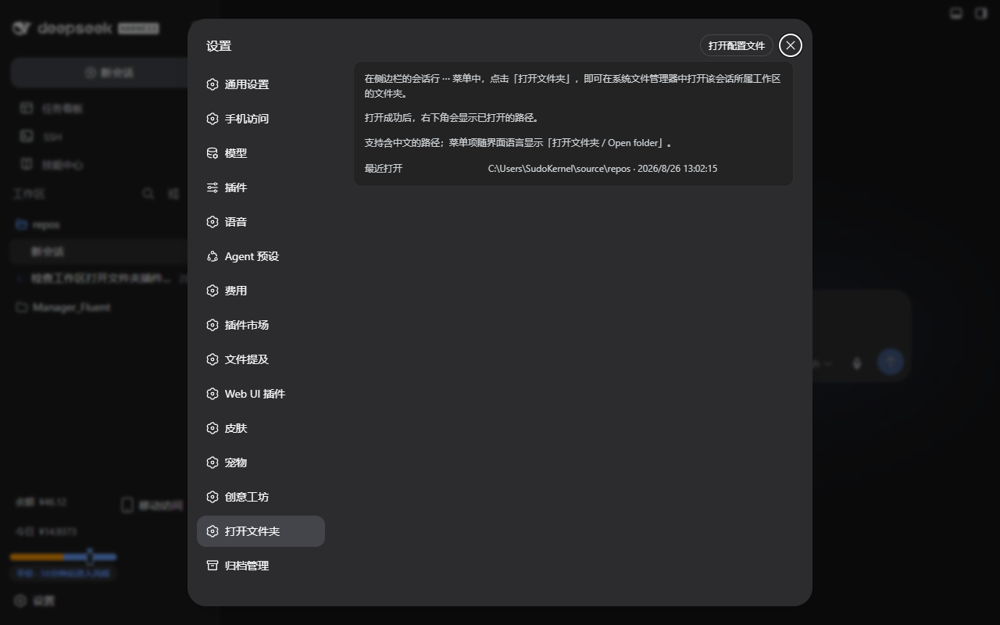

# dsh-open-folder

[](https://github.com/TussalZeus18028/dsh-open-folder)
[](https://github.com/TussalZeus18028/dsh-open-folder/blob/main/LICENSE)
[](https://github.com/topics/dsh-plugin)

在工作区（侧边栏会话列表）的会话行 **⋯ 菜单** 中增加一个 **打开文件夹** 项，点击后用操作系统默认文件管理器打开该会话所属工作区的文件夹。

Adds an **Open folder** item to the **⋯** overflow menu of session rows in the workspace sidebar, opening the session's folder in the host OS file manager.





## 功能 / Features

- 会话行 ⋯ 菜单（重命名 / 分叉会话 / 归档会话）末尾新增「打开文件夹」。
- 菜单项复用现有菜单项的样式类，跟随主题、支持键盘操作。
- 自动跟随界面语言（中文界面显示「打开文件夹」，英文界面显示 "Open folder"，错误提示同样本地化）。
- **设置页说明栏目**：设置 →「打开文件夹」分节，展示使用说明与最近打开的路径。
- **成功确认提示**：打开成功后右下角显示「已打开文件夹：<路径>」（远程访问/宿主机打开时也能确认操作成功）。
- **中文路径可靠打开**：内置 `host.openPath` 的 Windows 实现通过 `powershell.exe Invoke-Item` 打开目录，对含中文的路径（如 `E:\Launcher\服务器\...`）会"返回成功但资源管理器不弹出"。插件宿主半新增专属打开端点（`POST /plugins/dsh-open-folder/open`），直接用 `explorer.exe`（UTF-16 参数，中文路径可靠）打开；客户端优先走该端点，端点不可用时回退内置 RPC。
- **深浅主题适配**：设置页按钮/卡片/提示全部使用真实存在的 `--dsw-alias-*` 主题令牌，浅色/深色主题下均正常显示。

## 可靠性 / Reliability

- **工作区识别**：会话行与工作区分组行在 DOM 中是**兄弟节点**（并非父子），插件在每一层祖先的**前驱兄弟**中查找工作区分组行，再按工作区注册表解析目录 —— 每个可见会话行都能解析到正确文件夹。
- **空白会话（新会话行）可打开**：其标题是本地化文案、与存储标题不一致；解析直接落入所属工作区目录。
- **能力预检**：启动时查询 `host.describe().canOpenPath`；宿主不支持打开本地路径时不注入菜单项，而不是每次点击报错。
- **只注入会话菜单**：工作区 ⋯ 菜单（工作区"…"的操作）被显式排除，不会误注入。
- **无轮询**：重新注入由 `MutationObserver` + 菜单内指针事件驱动，不使用固定间隔轮询。
- 保留菜单保活（取消 `closeOnPointerLeave` 200ms 关闭）、代理点击与重渲染兜底。

## 安装 / Install

通过 GitHub 源安装（web profile 为例）：

```sh
dsh plugin --profile web add github.com/TussalZeus18028/dsh-open-folder
```

或在 **设置 → 插件市场**（需安装 [dshmarket](https://github.com/dsh-market/dsh-market)）中搜索安装。安装后重启 `dsh web`。

手动方式：将本目录加入 `$DSH_HOME/profiles/web/package.json` 的 `dependencies` 与 `dsh.profile.bundles`，然后在 profile 目录执行 `pnpm install` 并重启 `dsh web`。

> 已安装的 bundle 修改源码后**刷新页面**即可生效（bundle 内容按请求实时读盘）；宿主半（`lib/index.js`）改动需要重启 `dsh web`。

## 原理 / How it works

会话行菜单由内置 workspace UI bundle 渲染，未提供菜单项扩展槽位（`sidebar.workspaces` 是整块替换级单槽，无逐项扩展点）；本插件在浏览器端：

- 用 `pointerdown`/`click`/`focusin` 捕获阶段记录被点击的会话行（通过按钮 `aria-label` 中的标题、所在工作区分组与按钮引用）；
- 用 `MutationObserver` 监听打开的 `role="menu"`，仅向「会话行菜单」（由会话按钮武装，且含「分叉会话 / Fork session」等项）追加「打开文件夹」项；
- 解析目录顺序：**所在工作区分组 → 分组内会话精确匹配 → 全局标题匹配 → 当前会话**；
- 打开路径优先走插件自带的 `POST /plugins/dsh-open-folder/open` 端点（Windows 用 `explorer.exe` 直接打开，中文路径可靠），端点不可用时回退内置 `host.openPath` RPC。

## License

MIT
